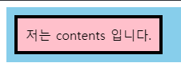
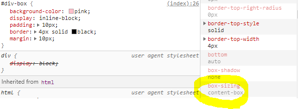
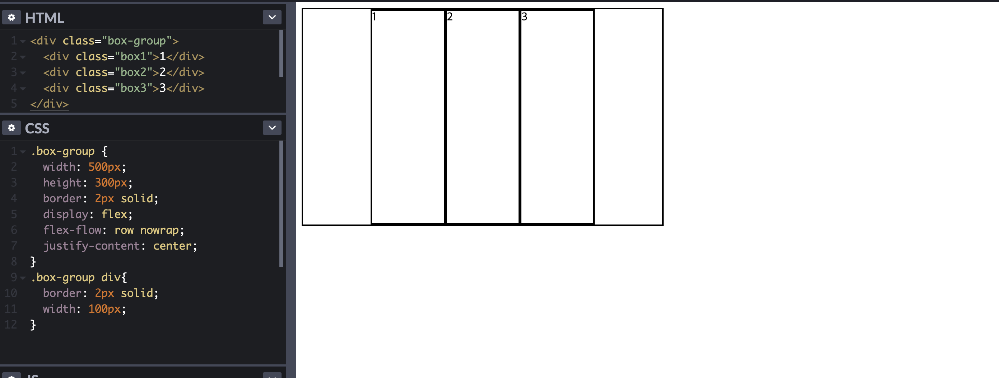
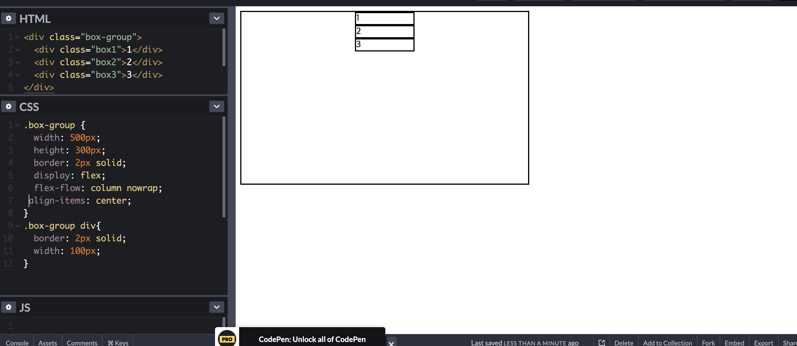

#HTML&CSS 3일차

1. 목차
  - Box Model
  - Float
  - Overflow
  - Display flex
  - 웹사이트 Header 영역

## Box Model

모든 HTML dythsms box 형태의 영역을 가지고 있다.
Box는 content, padding, border, margin 으로 구성이 된다.
width,height 속성을 가지는게 content 영역이다.
padding은 border 안쪽에 위치하는 영역이다.
margin은 border 바깥쪽에 위치하는 영역이다.
border는 테두리 영역이며, 테두리 두께를 가진다.




```
<div class="wrap">

  <div id="div-box">

    저는 contents 입니다.

  </div>
</div>
```
```
.wrap {
  background-color : skyblue;
}

#div-box {
  
  background-color : pink;
  display : inline-block;
  
  padding : 10px;
  
  border : 4px solid black;
  
  margin : 10px;
  
}


width와 height 속성은 컨텐츠 영역을 대상으로 한다.
box-sizing: content-box 가 기본 값이기 때문이다.(참고로 상속되지 않는 속성이다)


;

콘솔에서 보면 content-box로 되어 있다.

## Float

Float속성은 정렬을 위해 사용하는 속성이다. 일반적인 정렬과는 다르게 float 정렬된 것 주위로 
다른 컨텐츠가 흐르듯이 배치가 됩니다.

기본적으로 block element에서만 사용 가능합니다.
하지만 float를 사용해서 배치나 정렬을 할때 자식이 부모에게서 떨어져서 float를 
사용할 때에는 overflow나 ::after로 이용해서 클리어를 해 줘야지 내가 생각한 데로
정렬이 될 것이다.

## Overflow

float를 잘 배치 하려면 overflow를 사용해야한다. overflow는 독립적인 영역을 만드는데 overflow는 부모요소 크기로 영역을 다시 생성한다. 다시 크기를 읽기 때문에 부모요소를 따라가는데 부모요소 height값이 auto이기 때문에 자식요소를 다시 찾게 된다. 
잃어버린 자식을 찾게 되어서 overflow안에서 재 배치가 되어 진다. 하지만 overflow라는 속성은 position을 사용해서 이동하면 생각대로 안됀다. 그래서 가상 요소 선택자로 이용해서 정렬을 해야한다.

## clearfix

그래서 생각해 낸게 부모요소를 clear both를 시켜주는 거다. 
HTML문서 구조에서 부모요소가 자식 요소를 감싸고 있을 때 자식요소에게 float 형식을 적용하면 부모 요소가 자식 요소를 더이상 감싸지 않게 되고 높이 값을 파악하지 못하게 되는 버그가 발생한다. 따라서 부모요소의 높이 값이 0px로 출력되고, 전체적인 HTML 요소들이 뒤엉켜버리는 경우가 많다. 
이 때 부모 요소가 다시 자식 요소를 감쌀 수 있게 float을 초기화(clear) 하여 버그를 고쳐주는 (fix)코드가 필요한데 이것을 clearfix라고 한다.

## flex box

지금까지 float를 이용해서 정렬을 했지만 모던 방식인 flex로 이용하면 float보다 쉽게 배치를 할 수 있고 반응형 레이아웃 하는데도 도움이 된다.

flex는 justify-content, align-items로 중앙 정렬을 할 수 있다. 
하지만 float right left라고 생각하면 안됀다.
flex는 flex-direction의 값에 따라 flex-start flex-end의 값이 달라지고 flex-direction이 row일때 justify-content: center이지만
column일 때 에는 align-items:center 이다.


;

;

위와 같이 column일때와 row일때 reverse일때도 고려해야 한다.

