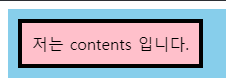

#HTML&CSS 3일차

1. 목차
  - Box Model
  - Float
  - Overflow
  - Display flex
  - 웹사이트 Header 영역

## Box Model

모든 HTML dythsms box 형태의 영역을 가지고 있다.
Box는 content, padding, border, margin 으로 구성이 된다.
width,height 속성을 가지는게 content 영역이다.
padding은 border 안쪽에 위치하는 영역이다.
margin은 border 바깥쪽에 위치하는 영역이다.
border는 테두리 영역이며, 테두리 두께를 가진다.
```<div class="wrap">

  <div id="div-box">

    저는 contents 입니다.

  </div>

</div>
.wrap {
  background-color : skyblue;
}

#div-box {
  
  background-color : pink;
  display : inline-block;
  
  padding : 10px;
  
  border : 4px solid black;
  
  margin : 10px;
  
}```


width와 height 속성은 컨텐츠 영역을 대상으로 한다.
box-sizing: content-box 가 기본 값이기 때문이다.(참고로 상속되지 않는 속성이다)
