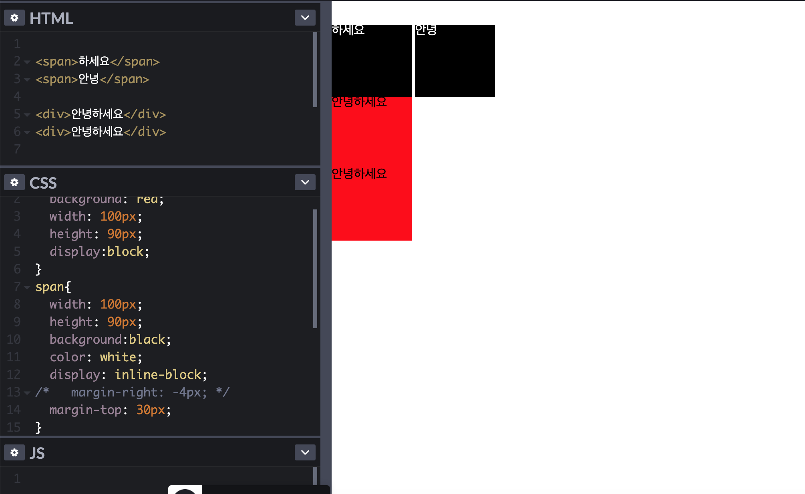
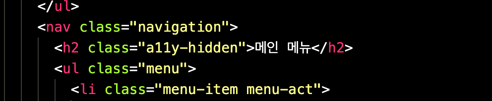
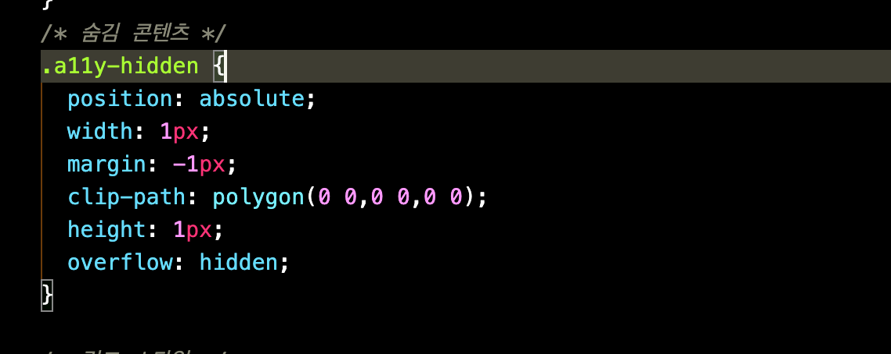

# HTML && CSS

1. 목차
  - 인라인 요소/블록 요소/인라인-블록 요소

# 블록 요소

블록요소는 모든 인라인 요소를 포함할 수 있고 다른 블록 요소도 일부 포함할 수 있습니다.
기본적으로 가로 폭 전체의 넓이를 가지는 직사각형 형태가 되며 width, height,margin,padding 등을 사용하여 형태를 변형하여 레이아웃을 수정할 수 있습니다. 그리고 블록 요소 다음에는 줄바꿈이 이루어 집니다.

블록의 영역은 지정 값 또는 지정 안할시 너비는 부모의 가로 크기, 세로는 컨텐츠 크기가 된다.
마진(auto),패딩을 이용하여 정렬을 할 수 있고 양 옆에 둘 수 없고 수직 상태로 쌓이게 된다.

# 인라인 요소

인라인 요소는 컨텐츠 크기 만큼 영역을 가지고 텍스트에 특화되어 있다. 텍스트 정렬에 영향을 받고 margin-left,right값을 가질 수 있지만 상 하 외부 여백(margin-top, margin-bottom)속성을 정의 해도 적용이 안되고 상, 하 여백은 margin이 아니라 line-height속성에 의해 발생하고 그리고  width값 height값은 못 준다. 인라인 속성을 가진 태그끼리 연속으로 사용되는 경우 최소한의 간격을 유지하기 위해 좌,우에 약 5px 가량의 외부 여백이 자동으로 발생합니다.

# 인라인-블록 요소

인라인 블록이라는 속성은 인라인과 같이 한 줄에 표현하면서도 margin, width, height 속성을 정의하면 표현해 줍니다. 
인라인과 다르게 inline-block은 다음과 같은 속성이 있습니다. 
상,하위 외부 여백 속성을 정의 할 수 있고 inline-block요소의 상 하 여백을 margin,line-height 두 가지 속성 모두를 통해 설정할 수 있습니다.
너비와 높이 속성이 적용하고 인라인과 같이 최소한의 간격을 유지하기 위해 5px 가량의 외부 여백이 자동으로 발생하지만 margin-left,margin-right를 사용하여 추가로 여백을 지정할 수 있습니다.

그림으로 보면

위와 같이 span은 인라인인데 display: inline-block으로 바꾸자 block요소 처럼 되었지만 inline과 같이 html 상 공백을 뛰어쓰기로 되어 있다.
margin을 사용해서 여백을 처리 할 수 있다.

# 각 마크업 대제목

웹 사이트상 않 보이지만 각 구역마다 제목이 있다. 사람들이 보기엔 눈에 보이는 큰 제목이 제목인 줄 알지만 접근성을 위해 대제목을 숨긴다.
그래서 틀 작업 할때 h1을 이용해 제목을 정한다. 그 제목을 숨기기 위해 많은 방법이 있다. display: none;으로 하면 스크린리더가 읽지 못하는 상황이 되기 때문에 
대제목에다 클래스를 지정하여 position값을 준뒤 width: 1px height: 1px margin: -1px 식 주고 overflow를 hidden으로 주면 사라진것 처럼 보이지만
작은 점같은게 눈에 띌 것 이다. 

위에 처럼 clip-path를 이용하면 투명하게 됀다. 화면상 않보인다. 하지만 어느 사람은 이걸 top: -9999px;로 주는데 이거는 잘못된 방식이다. 
스크린리더가 장애인을 위해 읽어줄때 읽어줄 수 는 있지만  스크롤이 위로 올라가는 현상이 일어 날 것이다.
