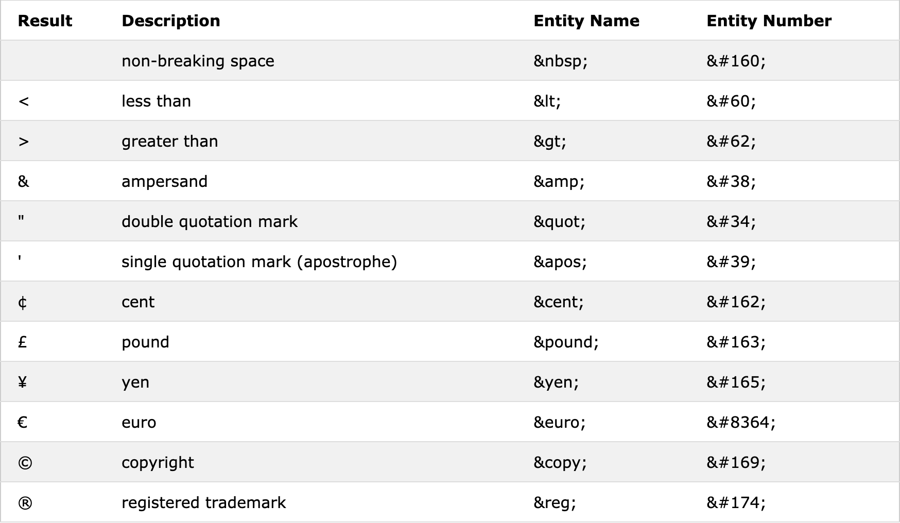

# HTML && CSS

1. 목차
  - 인라인, 인라인-블록 속성
  - Entities number
  - font-family
  - 멀티 백그라운드
  - 애니메이션 transform 이동 
  - reflow
  
## 인라인, 인라인-블록 속성

인라인 속성은 width값 height값 margin-top,bottom,padding 값을 주지 못하는 특성이 있다. 하지만 텍스트에 특화 되어 있어서 HTML에서
문자 콘텐츠를 쓰는 게 좋다. 
리스트 마크업 할때 인라인-블록을 쓸때도 있는데 블록 요소 처럼 width 값 height 값 margin,padding 값을 쓸 수 있다.
그리고 인라인 속성 처럼 옆으로 쌓이게 되는데 HTML에서 띄어쓰기 하면 옆에 마진이 생긴 것 처럼 띄어쓰기가 된다. 
마진은 없앨 수 있지만 메뉴 리스트를 만들때 큰 매력을 같게 된다. 
블록 요소로 만든다면 컨테이너 크기 보다 커질 경우 글자가 줄바꿈이 될 수 있다. 그래서 인라인-블록을 쓰고 인라인 속성의 white-space를 쓰면 줄바꿈
nowrap을 하면 줄바꿈이 안된다. 

## Entity Name

HTML 페이지에는 시각적으로 표현할 수 없으므로 인쇄 가능한 문자 만 제어문자로 표시하면 안된다. 예를들어 <, > 이런 거를 화면에 보여주고 싶을때 그냥 보여주면
문자가 아니라 HTML태그로 오인 해서 랜더링 할 수 도 있다. 그래서 entity name을 써서 표현을 해준다.
그리고 HTML에서 띄어쓰기를 많이 사용해도 한번만 띄어 쓰기가 된다.

Entity Name은 다음과 같다.

## font-family

글꼴을 지정할때 font-family를 지정한다.  글꼴은 궁서체 돋음체 가있고 sans-serif, serif라고 한다.
브라우저마다 지원하는 글꼴이 다를 수도 있어서 font-family를 지정할때 그 글꼴이 없을 경우를 대비해서 뒤에다 sans-serif,serif
를 꼭 지정해야한다. 

## 멀티 백그라운드

css로 이미지를 사용할 때 background 로 주는데 2개의 이미지를 넣고 싶을때 ',' 로 구분한다.
멀티 백그라운드를 줄 때 규칙이 있다. 마크업할때에는 나중에 마크업 한게 제일 앞에 가는게 기본적인데
이 것은 반대이다. 멀티 백그라운드를 마크업 할 때에는 나중에 마크업 한게 제일 뒤로 가고 최근에 마크업한게 
맨 앞으로 간다. 
backgroud: url() , #... linear-gradient() 이런 식으로 준다. 추가 속성을 넣을때 그 url 뒤에 띄어쓰기 하고 넣으면 된다.
이렇게 속기법으로 많이 하지만 가상 클래스에 넣을때는 속기법으로 쓰면 안되고 개별 속성으로 넣어 줘야 한다. 

## 애니메이션 transform 이동 

애니메이션으로 이동할 때 transform으로 이동 하는 것이 성능 상 좋다. margin,padding으로 넣어서 이동 할 때 리폴로우가 발생하여서
성능상 떨어질 수 있지만 transform으로 이동 하는 것은 cpu를 사용하지 않고 gpu로 그래픽 처리로 한다.

## reflow

위와 같이 리플로우가 발생 한다고 하는 것은 모든 엘리먼트의 위치와 길이 등을 다시 계산하는 것으로 문서의 일부 혹은 전체를 다시 렌더링한다. 단일 엘리먼트 하나를 변경해도, 하위 엘리먼트나 상위 엘리먼트 등에 영향을 미칠 수 있어서 리플로우를 발생 하는 것은 사용하는 것을 추천하지 않는다.
