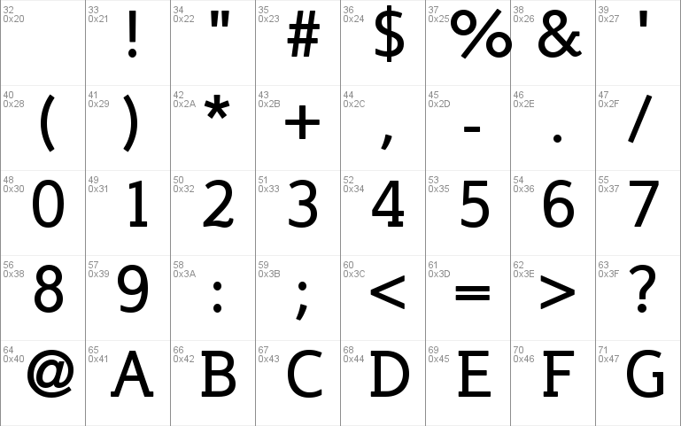

# Unicode

## 유니코드

전 세계의 모든 문자를 담는 코드표를 사용함으로써 각언어와 문자 체계에 따른 충돌 문제를 해결하였다. 따라서 유니코드를 사용하면 한글과 신자체 간체자 아랍 문자 등을 통일된 환경에서 깨뜨리지 않고 사용할 수 있게 한다. 

아스키코드에서도 살펴보았듯이 유니코드도 컴퓨터가 알아들을 수 있게 해석? 해주는 역할 이다.  

한글은 자음과 모음의 조합 가능 개수만 따져도 128개를 넘는다. 중국어 역시 한자의 개수가 만 개가 넘는다. 이를 어떻게 아스키 코드에 담을 수 있을까? 
그래서 용량을 크게 확장한 2byte의 유니코드가 등장하게 되었고 유니코드 3.0버전까지는 2바이트 영역을 가리켜 기본다중언어판이라고 불렸다. 

처음에는 온 세상 문자를 모두 담을 수 있을거라고 생각했지만 쓰지 않는 고어, 아프리카 토속어 등 모든 문자를 담으려다 하다보니 이마저도 부족했고 이를 해결하기 위해 유니코드 3.0 부터 보충언어판을 정의 했다.

문자 인코딩 형태는 특정한 문자 집합 안의 문자들을 컴퓨터 시스템에서 사용할 목적으로 일정한 범위 안에 정수들로 변환하는 방법이 있다. 여기에는 유니코드 코드 포인트를 8비트 숫자의 집합으로 나타내는 UTF-8이나, 16비트의 숫자의 집합으로 나타내는 UTF-16등이 포함된다.

유니코드는 아래와 같다.

# ASCII

들어가기에 앞서 이것을 이해해야 한다.

컴퓨터의 기본 저장 단위는 바이트이고 1바이트는 8비트이다. 1byte에는 256개의 고유한 값을 저장할 수 있다.
문자나 기호들의 집합을 컴퓨터에서 저장하거나, 통신 목적으로 사용할 경우에는 부호로 바꾸어야하고 이를 문자 인코딩 또는 부호화이다.
모스부호도 일종의 문자 인코딩이다.

## 아스키(ASCII)

아스키(American Standard Code for Information Interchange)에 풀네임에서 알 수 있듯이 1960년대 정의한 표준화한 부호체계이다.
아스키코드를 사용하는 이유는 컴퓨터는 2진수 형태의 모습을 가지고 있고 우리가 이해할 수 있는 언어를 그대로 사용한다면 컴퓨터는 이해를 할 수 없다. 
그래서 이것을 컴퓨터가 이해하기 위한 하나의 방법으로 10진수의 아스키 코드나 16진수의 유니코드와 같은 형식이 필요한 것이다. 
우리가 다른 언어를 이해하기 위해서 번역하는 것 처럼 아스키나 유니코드도 컴퓨터에 맞게 번역한다는 느낌인거 같다.

여러가지 이유로 아스키코드는 7비트 즉, 128개의 고유한 값만 사용한다.
컴퓨터의 기본 저장 단위는 1바이트라고 하였는데 왜 아스키코드는 7비트만 활용할까? 그 이유는 1비트를 통신에러 검출을 위해 사용하기 때문이고 통신 에러 검출을 위한 비트를
Parity Bit라고 한다.

ASCII코드는 0부터 127까지 128개의 고유값을 저장 한다. 0부터 32 까지는 인쇄와 전송 제어용으로 사용되는 알 수 없는 용어들이고 33부터 126까지는 숫자, 알파벳 소문자, 알파벳 대문자, 특수기호 등이 할당되어 있다.

ASKII코드는 아래와 같다.

